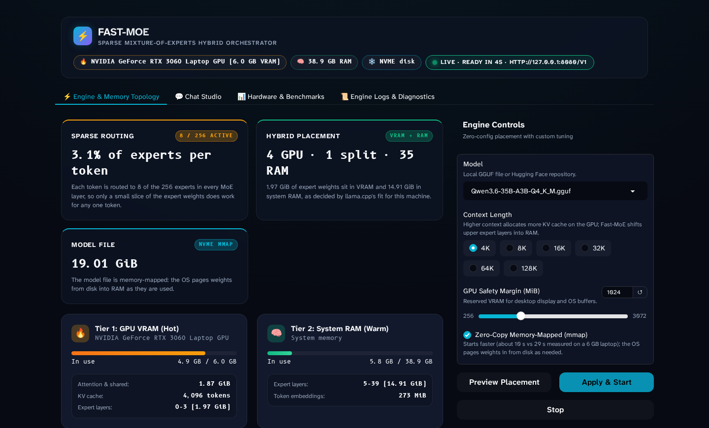
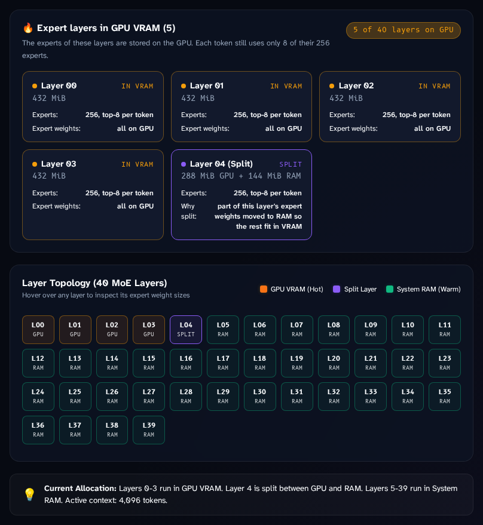
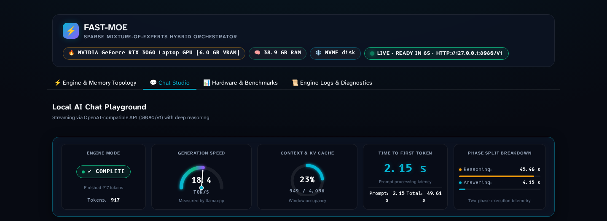
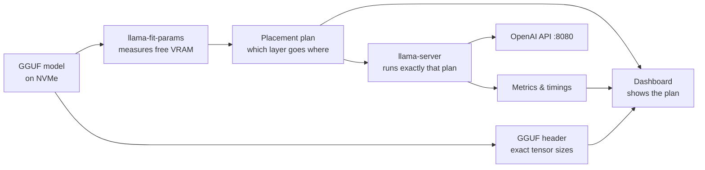

<div align="center">

# ⚡ Fast-MoE

### Run a 35-billion-parameter AI model on a 6 GB gaming laptop, and see exactly where every part of it lives.

[](https://github.com/VIGNESHM-ENGR/Fast-MoE/actions/workflows/ci.yml)
[](LICENSE)




<sub>Live dashboard: Qwen3.6-35B-A3B running on an RTX 3060 Laptop (6 GB VRAM). Every number is read from the running system.</sub>

</div>

---

## In one minute

**The problem.** The best open AI models no longer fit on the graphics cards most people own. A 35B model needs ~19 GB even when compressed; a typical laptop GPU has 6–8 GB. Making it run anyway means hand-tuning obscure flags, and nobody can see what actually happened.

**What Fast-MoE does.** It runs these models on ordinary hardware with **one command and zero tuning**. It splits the model between the graphics card, system memory and disk, and gives you a dashboard that shows, in plain language, which parts went where and what that costs in speed.

**Why it works.** Modern "Mixture-of-Experts" models only use a few percent of themselves for each word they write (8 of 256 experts per token for Qwen3.6). So the always-used parts can live on the fast GPU while the rest waits in RAM, and the model still answers at conversational speed.

## Results on a 6 GB laptop

Measured on an ASUS TUF laptop: **RTX 3060 Laptop GPU (6 GB)**, Intel i5-11400H, 38 GB RAM, NVMe SSD.

| | Qwen3.6-35B-A3B (Q4_K_M, 19 GiB) |
|---|---|
| **Writing speed** | **18.3 tokens/s** native · 18.1 tokens/s in Docker (measured by llama.cpp) |
| **Time to first word** | ~2 s |
| **Ready to chat** | 19 s from pressing *Apply & Start* |
| **Where it lives** | Layers 0–3 on the GPU · layer 4 split · layers 5–39 in system RAM |
| **GPU memory used** | 4.9 of 6.0 GB |
| **Without any GPU** | Still runs: 3.9 tokens/s on the CPU alone |

<sub>One machine, one run each; your numbers will differ. Benchmarks against hand-tuned llama.cpp are on the roadmap.</sub>

## What you see

<table>
<tr>
<td width="50%" valign="top">

**Every layer, mapped.** Orange layers run on the GPU, green ones from RAM, purple ones are split between the two. Hover any layer for its exact size. Change the context length and the preview shows which layers move off the GPU *before* you restart anything.

</td>
<td width="50%" valign="top">

</td>
</tr>
</table>

**Live telemetry while you chat.** Speed, context used, time to first token and how long the model spent reasoning versus answering, all taken from the inference server itself rather than estimated.



## Quick start

### With Docker (recommended)

```bash
git clone https://github.com/VIGNESHM-ENGR/Fast-MoE.git && cd Fast-MoE
docker compose up                              # NVIDIA GPU
# or: docker compose -f docker-compose.cpu.yml up   (no GPU)
```

Open **http://127.0.0.1:7860**, pick a model, press **Preview Placement**, then **Apply & Start**. The model downloads on first use (Qwen3.6-35B-A3B is 19 GiB) into `./models`.

<details>
<summary>GPU prerequisite: NVIDIA Container Toolkit</summary>

Install the [NVIDIA Container Toolkit](https://docs.nvidia.com/datacenter/cloud-native/container-toolkit/latest/install-guide.html). On Ubuntu, after adding NVIDIA's apt repository:

```bash
sudo apt-get install -y nvidia-container-toolkit
sudo nvidia-ctk runtime configure --runtime=docker
sudo systemctl restart docker
```

The container runs as UID/GID 1000 so downloaded models belong to you; set `FAST_MOE_UID` / `FAST_MOE_GID` if your user differs. Both ports are published on localhost only.
</details>

### Without Docker

```bash
pip install -e .
scripts/build_llama_cpp.sh     # builds a pinned llama.cpp release with CUDA (~10 min)
python -m ui.app               # dashboard at http://127.0.0.1:7860
# or headless:  python -m engine.serve
```

Any OpenAI-compatible client can use the model at **http://127.0.0.1:8080/v1** while it runs.

## How it works



1. **Measure.** llama.cpp's own `llama-fit-params` checks free GPU memory and decides how many experts fit on the GPU at the context length you asked for.
2. **Map.** Fast-MoE reads the model file's tensor list and applies llama.cpp's placement rules to it, so the dashboard knows the size and location of every layer's experts.
3. **Run.** `llama-server` starts with exactly those arguments and automatic re-fitting turned off, so **what you see is what runs**.
4. **Page.** Weights are memory-mapped: the operating system pulls expert weights from the NVMe drive into RAM as they are used.

## For engineers

<details open>
<summary><b>Design decisions</b></summary>

- **Integrate, don't reinvent.** Inference, kernels, placement and the OpenAI API are llama.cpp. Downloads are `huggingface_hub`. Fast-MoE is the glue, the zero-config defaults and the visibility layer.
- **The displayed placement is the executed placement.** `llama-fit-params` output (`-c`, `-ngl`, `-ot ...exps=CPU`) is mapped onto GGUF tensor metadata with llama.cpp's own rules (`-ngl` offloads the last N layers; `-ot` is a regex search on tensor names), then passed to `llama-server --fit off`.
- **No invented numbers.** Every figure comes from the fit plan, NVML, psutil, `/metrics`, or the server's per-request `timings` and `usage`. Unknown values render as "—". There are tests for this.
- **One container, not two.** The dashboard restarts `llama-server` with new fitted arguments; a separate server container would need the Docker socket. The image builds on the pinned official `ghcr.io/ggml-org/llama.cpp` server image.
- **Safe defaults.** Ports bind to localhost; previews are refused while a server holds VRAM (it would skew the fit); the hardware profiler respects cgroup memory limits inside containers.
</details>

<details>
<summary><b>Command-line options and environment variables</b></summary>

`python -m engine.serve [--model REPO_OR_GGUF] [--quant Q4_K_M] [--ctx 16384] [--vram-margin-mib 1024] [--no-mmap] [-- extra llama-server flags]`

| Tool | Purpose |
|---|---|
| `python -m engine.hardware` | GPU, RAM (cgroup-aware), disk speed, CPU features, tier budgets |
| `python -m engine.models.model_downloader --list` | Available quantizations for a Hugging Face GGUF repo |

| Variable | Default | Meaning |
|---|---|---|
| `FAST_MOE_MODELS_DIR` | `./models` | Where GGUF files are stored |
| `LLAMA_CPP_BIN_DIR` | native build | Directory containing `llama-server` |
| `FAST_MOE_API_HOST` | `127.0.0.1` | Address `llama-server` listens on |
| `FAST_MOE_UI_HOST` / `FAST_MOE_UI_PORT` | `127.0.0.1` / `7860` | Dashboard address |
</details>

<details>
<summary><b>Repository layout</b></summary>

```
engine/hardware/   hardware profiler and memory budgets
engine/llama/      fit-params parsing, GGUF layout, placement, llama-server supervisor
engine/models/     model downloader, MoE architecture descriptor
engine/serve.py    headless one-command launcher
ui/                Gradio dashboard (board, chat telemetry, metrics)
tests/             unit tests (no GPU needed); CI runs lint, tests and a Docker smoke test
```
</details>

## Tested with

| Model | Architecture | Result on the 6 GB laptop |
|---|---|---|
| Qwen3.6-35B-A3B Q4_K_M | 40 layers, 256 experts, 8 active | 18.3 tokens/s, layers 0–3 on GPU |
| Qwen3-30B-A3B Q4_K_M | 48 layers, 128 experts, 8 active | 16–18 tokens/s, layers 0–7 on GPU |

Other Mixture-of-Experts models that llama.cpp supports should work; these two are the ones verified so far.

## Roadmap

- [x] One-command launcher, dashboard, Docker (GPU and CPU), CI
- [ ] Benchmarks against hand-tuned `--n-cpu-moe` on the same hardware
- [ ] Recommended context length per model, from measurements
- [ ] Live per-expert activity (needs routing statistics llama.cpp does not expose yet)
- [ ] Models larger than RAM: measure how far NVMe paging stretches

Full plan and decision log: [TASKS.md](TASKS.md) · scope: [PROJECT_SCOPE.md](PROJECT_SCOPE.md) · changes: [CHANGELOG.md](CHANGELOG.md)

## Development

```bash
pip install -e ".[dev]"
ruff check engine ui tests
pytest
```

## Credits

- [llama.cpp](https://github.com/ggml-org/llama.cpp): the inference engine underneath.
- [Qwen](https://huggingface.co/Qwen): the Qwen3.6 and Qwen3 models; GGUF builds by [ggml-org](https://huggingface.co/ggml-org).
- [KTransformers](https://github.com/kvcache-ai/ktransformers), [MoE-Infinity](https://arxiv.org/abs/2401.14361) and [PreScope](https://arxiv.org/abs/2509.23638): research on CPU/GPU expert offloading that shaped this project.

## License

Apache-2.0. See [LICENSE](LICENSE).
